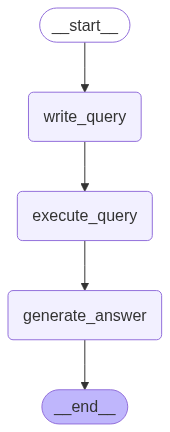
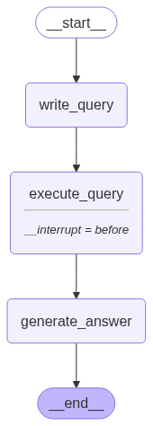
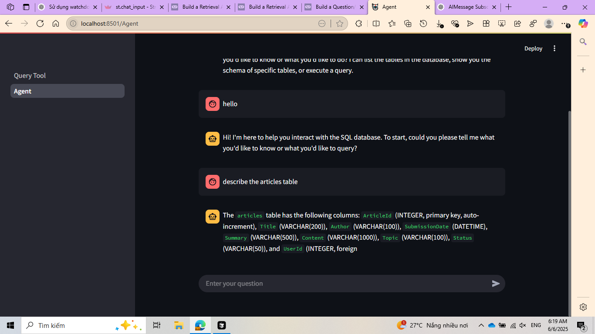

### A Simple App for SQL Query

<h1>Steps</h1>

<b>Create virtual environment</b>
<pre>python -m venv venv</pre>

<b>Install packages</b>
<pre>pip install -r requirements.txt</pre>

<b>To run app:</b>
<pre> streamlit run pages/Query_Chat.py </pre>

<b>Add your API Key to file .env</b>
<pre>
GOOGLE_API_KEY=...
OPENAI_API_KEY=...
</pre>

<h2>Query Chat Page</h2>

Load a LLm model according to your API Key

Connect to your SQL Database

Query Chat have two mode: normal and memory saving

<b>Normal mode</b>: the chatbot can not save the previous query

<b>Memory saving mode</b>: the chatbot can save the previous query

<h2>Agent Page</h2>

You can chat with the agent about your database
