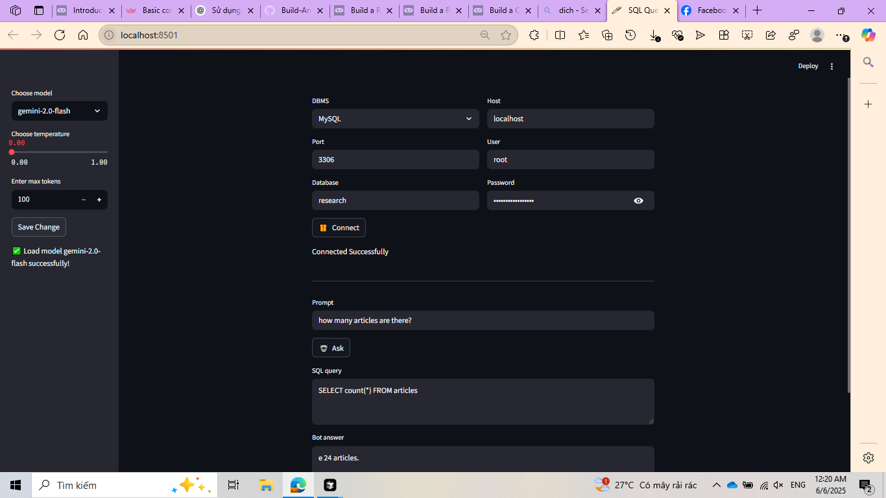

### A Simple App for SQL Query

<b>Create virtual environment</b>
<pre>python -m venv venv</pre>

<b>Install packages</b>
<pre>pip install -r requirements.txt</pre>

<b>To run app:</b>
<pre> streamlit run pages/Query_Chat.py </pre>

<b>Add your API Key to file .env</b>
<pre>
    GOOGLE_API_KEY=...
    OPENAI_API_KEY=...
</pre>

